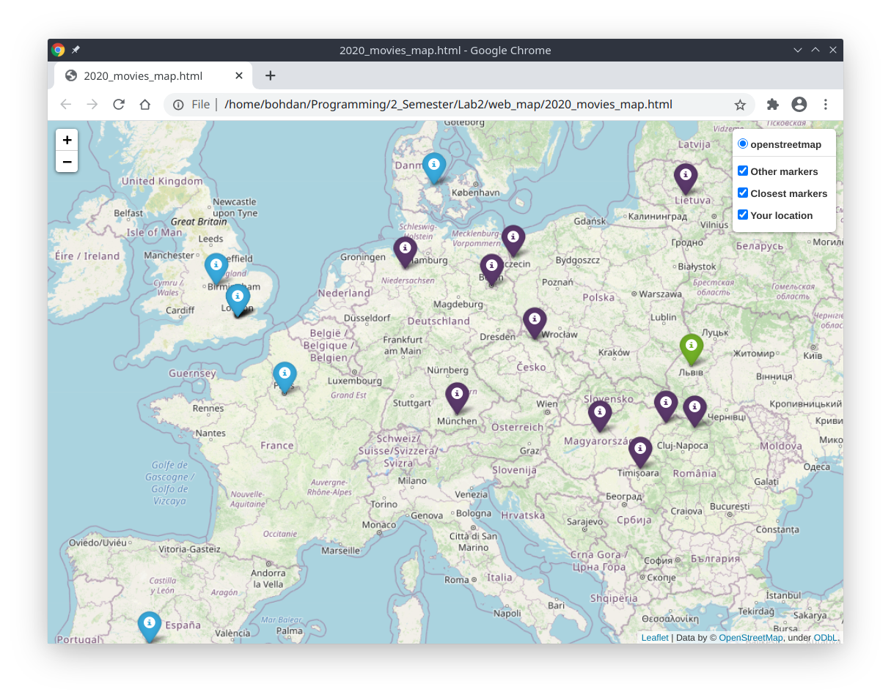

# Movies Map

  

## Description

This is a project for finding nearest movie filming locations around the user.

  

## Usage

To use this program you firstly need to launch main.py.

  

Then a prompt would show up asking you to enter the year you would like to have a map for.

  

After that another prompt will appear asking you to enter your current location.

  

And finally after approximately 2-3 minutes the map will appear in your current directory as an html file.


```bash
$ python main.py
Please enter a year you would like to have a map for: 2020

Please enter your location (format: lat, long): 49.838425328968846, 24.03042991535878

Finding locations...

Please wait...

Generating map...

Finished. Open 2020_movies_map.html to see the results
```

  

## Result

